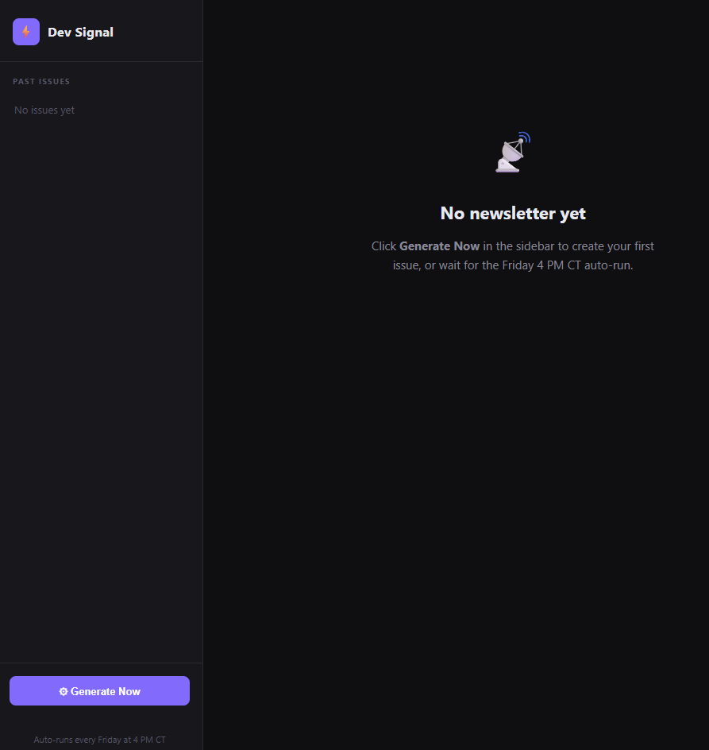
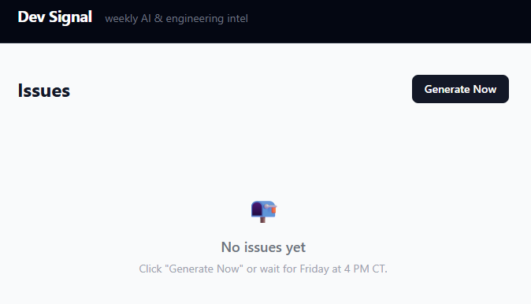
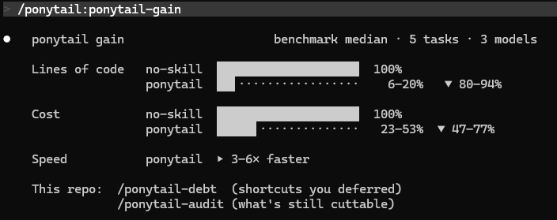
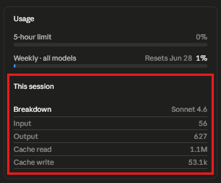
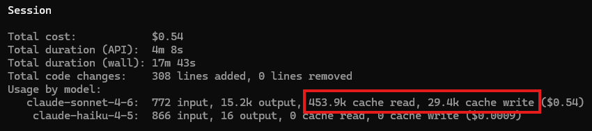

# newsletter-app: no-skill vs ponytail

Same app ("Dev Signal" / newsletter-app), built twice from the same prompt — once with no skill, once with the [ponytail](https://github.com/DietrichGebert/ponytail) plugin active.

| | `main` (no-skill) | `test-ponytail` |
|---|---|---|
| Repo | this repo, `main` branch | this repo, `test-ponytail` branch |
| Screenshot |  |  |

## Lines of code

Counted with `git show <branch>:<file> | wc -l` over `.py` / `.html` / `.css` source files (excludes `.db`, `.gitignore`, `README.md`).

| File | no-skill | ponytail |
|---|---:|---:|
| app.py | 59 | 40 |
| database.py | 80 | 43 |
| generator.py | 121 | 82 |
| scheduler.py | 36 | 21 |
| templates/index.html | 146 | 36 |
| templates/issue.html | — | 51 |
| templates/base.html | — | 22 |
| static/style.css | 397 | — (inlined in base.html) |
| **Total** | **839** | **295** |

**This repo: 295 / 839 = 35% of original → 65% reduction.**

## Ponytail's own benchmark claim (for reference)

Ponytail's published benchmark (5 tasks, 3 models, median) claims ponytail code lands at 6–20% of no-skill LOC (80–94% reduction). This repo's single data point (65% reduction) falls outside that claimed range — directionally consistent (ponytail is smaller), but less aggressive than the benchmark median. One sample, one task: not a refutation, just a data point.

## Token / session usage

The two builds were captured with different UI panels, so this is what's available rather than a perfectly matched comparison.

**no-skill build** — usage widget, this session:

- Input: 56 · Output: 627 · Cache read: 1.1M · Cache write: 53.1k (model: Sonnet 4.6)

**ponytail build** — full session summary:

- Cost: $0.54 · API duration: 4m8s · Wall duration: 17m43s · Code changes: +308/-0
- claude-sonnet-4-6: 772 input, 15.2k output, 453.9k cache read, 29.4k cache write
- claude-haiku-4-5: 866 input, 16 output, no cache

## Takeaway

Ponytail produced a ~65% smaller codebase for the same app on this task — fewer files (no separate CSS, one route style instead of two), no defensive plumbing the no-skill build added speculatively. Token/cost numbers aren't directly comparable here since the two screenshots come from different panels.
